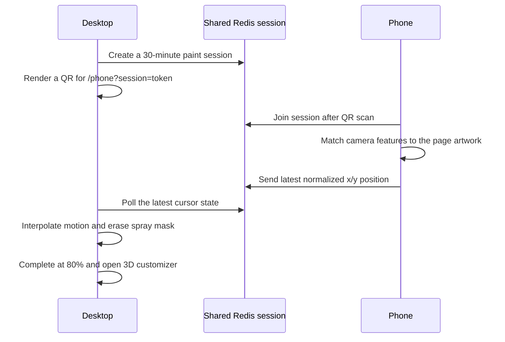

# Sunday Memo — Phone Paint Experiment

An unofficial creative-technology experiment that turns a phone into a physical spray-paint tool for a desktop webpage. Scan the QR code, point the phone camera at the desktop artwork, and move the phone across the screen to reveal a second world. At 80% coverage, the remaining image completes with the same graffiti texture and opens a scroll-controlled 3D customization scene.

**[Open the live demo](https://sunday-phone-paint-demo.vercel.app)** · Best experienced with a laptop and a phone


> [!IMPORTANT]
> This is an independent, fan-made technical demo. It is not affiliated with, endorsed by, sponsored by, or commissioned by Sunday Robotics. The Sunday name, logo, visual identity, and any related intellectual property belong to their respective owners. Their inclusion here is solely to explore an interaction concept; this repository does not grant permission to reuse those assets.

## What makes it interesting

- The webpage itself is the tracking target—there are no large fiducial markers.
- The phone's physical position becomes a normalized brush coordinate on the desktop.
- The reveal is built from irregular, rotated spray stamps rather than a soft circular eraser.
- Cross-device cursor updates are reduced to the latest position and interpolated at display rate for smoother motion.
- The final 20% resolves through procedural graffiti bursts instead of a conventional fade.
- The revealed hero becomes a vertically curved ring of optimized GLB objects with bloom, grain, and restrained front-facing motion.
- A Sunday-style boot sequence covers asset preparation so the hidden video never flashes before the opening artwork.

## Experience flow



## How the effects work

### Markerless artwork tracking

The phone uses OpenCV.js ORB features extracted from the live camera image and compares them with both the opening artwork and the revealed poster. Descriptor matches are filtered, then RANSAC estimates a homography from the reference image into the camera view. The center of the camera becomes the brush point, mapped back into normalized artwork coordinates.

### Spray-paint reveal

The desktop keeps the starting artwork on a high-resolution canvas above the hidden looping video. A cached procedural brush atlas generates irregular edges, droplets, secondary bursts, jitter, scale changes, and rotational stutters. Each stamp uses Canvas 2D `destination-out`, so painting removes the opening canvas and exposes the moving layer beneath it.

### Smooth cross-device motion

The phone never queues a backlog of vision results. It sends only the newest available position, while the desktop polls a short-lived shared session and interpolates toward the latest target on every animation frame. Local development uses an in-memory store; production uses Upstash Redis so the phone and desktop can safely reach different Vercel instances.

### Completion and 3D scene

Coverage is measured on a lightweight occupancy grid. At 80%, uncovered cells become candidates for a rapid procedural finishing pass, preserving the spray language through the transition. The customization view loads four compressed GLB assets in Three.js, positions them along a downward vertical arc, and uses wheel input to rotate the selection. Each object now oscillates only a few degrees, keeping its front oriented toward the viewer.

For a deeper walkthrough, see [Implementation notes](docs/IMPLEMENTATION.md).

## Run locally

Requirements: Node.js 22.13 or newer.

```bash
npm install
npm run dev
```

Open [http://localhost:3000](http://localhost:3000). A phone camera requires a secure HTTPS origin. Point `PHONE_PAINT_PUBLIC_ORIGIN` at an HTTPS tunnel when testing across devices:

```bash
PHONE_PAINT_PUBLIC_ORIGIN=https://your-secure-origin.example npm run dev
```

Without Redis credentials, local development automatically uses an in-memory session store. Copy `.env.example` if you want to test the shared production path locally.

## Deploy to Vercel

1. Import this GitHub repository into Vercel as a Next.js project.
2. Add the **Upstash for Redis** Marketplace integration to the project.
3. Confirm it provides `KV_REST_API_URL` and `KV_REST_API_TOKEN`.
4. Deploy. The QR API derives its public phone URL from the incoming Vercel request, so no production origin override is required.

Every push to `main` is deployed automatically through the connected Vercel project.
The project is configured with Vercel’s Next.js framework preset and deployed in `iad1`.

If session requests fail with an Upstash authentication error after connecting the
Marketplace database, remove only the database-to-project connection, reconnect it
for Preview and Production, and redeploy. This regenerates the integration-managed
credentials without deleting the database.

## Verification

```bash
npm test
npm run lint
npm run build
```

The source-contract suite protects the 80% completion threshold, phone-only painting, markerless tracking, QR sticker, optimized video sources, loading sequence, 3D ring behavior, and shared production session path.

## Project structure

```text
app/
  api/                 Cross-device session endpoints
  components/          Navigation, boot sequence, and Three.js customizer
  lib/                 Artwork tracking, spray brush, and shared session store
  DesktopExperience    Reveal canvas and completion choreography
  PhoneExperience      Camera tracking and latest-position transport
public/
  artwork/             Optimized reference and UI artwork
  media/               Optimized revealed hero video and poster
  models/              Draco-compressed GLB customization objects
docs/
  IMPLEMENTATION.md    Detailed technical walkthrough
```

## Creator

Built by **Nicholas** as a creative-technology experiment.

I am currently looking for creative technology roles spanning interactive experiences, creative direction, real-time 3D, AI-native production, and experimental interfaces.

- Portfolio: [www.itsnicholas.com](https://www.itsnicholas.com)
- Email: [nicholas@withlore.co](mailto:nicholas@withlore.co)

## Rights and usage

No license is granted for Sunday Robotics trademarks, logos, artwork, trade dress, or other third-party assets included in this demonstration. All such rights remain with their respective owners. The repository is public for educational review and portfolio documentation; public availability should not be interpreted as permission to reuse branded assets.
